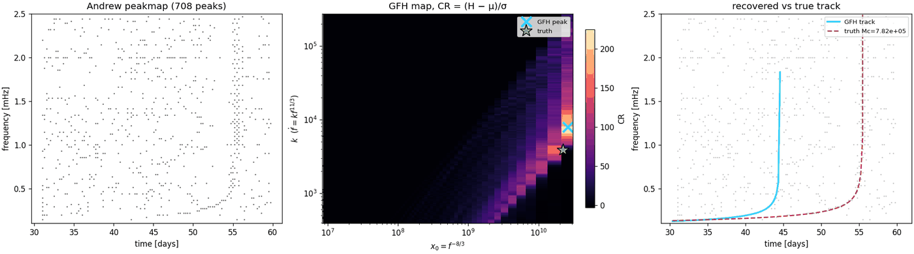

# Current investigations

## GFH cross-check (Andrew's suggestion) — done

He suggested the corner problem was a **mapping** issue and to test with
`gfh.LongT_GENERALIZED_fasthough_nonuni` (gfh.py:271). Ran it directly on our WDM peakmap,
braking index n = 11/3 (`fdot = k f^(11/3)`).

**Setup notes (two conventions I got wrong first time):**

* Peakmap wants normalised power with **mean 1** (exponential). Ours is χ²₂ from two whitened
  channels → mean 2. Halve it. Got 21% occupancy before, 5.9% after.
* `andrew_long_transient_grid_k` forms `kmin = fdot_min/f_max^n`, `kmax = fdot_max/f_min^n`.
  Pass the fdot range inverted through that or the k grid spans 8 orders of magnitude.
* Physical k range for Mc 2e5–1e7 M☉ is `[3.97e2, 2.69e5]`.

**Result: the mapping is fine. Parameters are wrong, and the track only agrees where the
family is degenerate anyway.**



| chunk | Mc | tc |
|---|---|---|
| 2 | ×1.54 | −264 h |
| 7 | ×1.46 | −273 h |

⚠️ **My first read of the track agreement was too generous.** Splitting chunk 2 by time:

| window | n | median \|Δf\| | within 2 bins |
|---|---:|---:|---:|
| all in-band | 188 | 0.5 bins | 76% |
| first half | 94 | **0.2 bins** | **100%** |
| last half | 94 | 1.9 bins | 51% |

The agreement is entirely in the flat early inspiral, where *any* `(x0, k)` on the ridge looks
the same. The GFH track hits 2.5 mHz at ~44 d against a true merger at 55.6 d — they visibly
diverge (right panel). So "the track comes back" is only true for the part that carries no
information.

* `x0` pins to **the same grid-edge value in both chunks** (lowest-frequency bin). Classic
  degeneracy signature — with only the early, nearly-flat inspiral in band, `x0` and `k` trade
  freely and the max slides to the boundary.
* Algebra also verified independently to **1e-15**: `x = f^(-8/3)` linearises our Newtonian
  track, `k = −A`, `tc = −x₀/k`, `Mc` exact.

**So the corner was something else — and it's exactly his LIGO analogy.** Unwhitened *resolved
GBs*. They're horizontal in the TF plane; a high-mass chirp is nearly flat through early
inspiral; so unabsorbed lines masquerade as flat high-Mc tracks and drag the peak into the
corner. Cause was our PSD having more frequency blocks (256) than the WDM had channels (101) —
155 empty, interpolated across, lines never removed.

Fix = one block per channel. Max row-mean ρ 45.8 → 5.7. **False alarms 2 → 0, sources 6/15 →
9/15, mass ratios ×0.08–2.59 → ×0.71–1.12.**

**Still worth adopting the GFH linearisation** — not for the corner, but for shift-invariance in
`x₀` (one `bincount` per k instead of a 2-D scan), a uniform grid, and a straight ridge.

**Open question for Andrew:** `gridx = flip(1/f^(n-1))` on a uniform f-grid gives non-uniform x
bins. With 0/1 votes that's fine. With a **soft** weight, does the varying bin width bias the
accumulator, and does the shift-invariant `bincount` still hold?


## Why GFH misses a track that's visible by eye

Chunk 2, counting peaks lying within 1 bin of each candidate track:

| | x₀ | k | peaks on track |
|---|---:|---:|---:|
| truth | 2.24e10 | 3.85e3 | **33** |
| GFH peak | 2.59e10 | 7.90e3 | 3 |

So the *data* prefer the truth by 10:1. The failure is the **x-grid**, not the statistic.

`gridx = flip(1/f^(n-1))` is built from a **uniform f grid**. At our band floor:

```
f = 1.00e-4 → x = 4.64e10
f = 1.24e-4 → x = 2.59e10     adjacent bins ~2e10 apart
f = 1.49e-4 → x = 1.67e10
```

* True `x₀ = 2.24e10` **falls between grid points — it is not representable.**
* Bin widths span 2.2e5 → 2.0e10, a ratio of **91,000×**.
* Those huge low-frequency bins swallow any track sitting at low f for most of the chunk: one
  template collects **320 of 708** peaks while truth gets 26.

Not a bug in pyhough — a **band mismatch**. GFH is built for CW/transient-CW with small
fractional bandwidth. We search 0.1→2.5 mHz, a factor 25, so `x` spans 25^(8/3) ≈ 4600 and a
uniform-f grid cannot resolve it. Fix: build the grid uniform in `x` (or log-x), or narrow the
band per template family.

## Viterbi / track-before-detect — tested, negative

No parametric family: best path through the TF plane with a bounded per-step frequency jump.
Runs in **<0.01 s** per chunk. Median |Δf| over the whole in-band stretch looked good (0.8–2.1
bins) — but the control kills it:

| chunk | first half | last half | last 20% | **reversed-map control** |
|---|---:|---:|---:|---:|
| 2 | 1.0 | 4.0 | 7.7 | **2.0** |
| 7 | 0.9 | 3.8 | 7.4 | **1.8** |
| 13 | 0.4 | 1.9 | 4.4 | **0.8** |
| 21 | 0.5 | 2.0 | 4.5 | **0.8** |

Running on a **time-reversed** map (destroys any rising chirp) does *as well or better*. The path
is following whatever is bright at low frequency, not the signal.

## ⚠️ The lesson underneath both

**Almost all of an MBHB's in-band time is spent in the flat, uninformative early inspiral. The
discriminating information is in the last ~20%.** Any metric averaged over the whole in-band
stretch is dominated by the part that carries no information — which is how both the GFH track
claim and the Viterbi result looked good and were meaningless.

Consequences:

* **Always use a reversed-map or scrambled control** when claiming a track was recovered.
* **Evaluate on the last 20%**, not the whole span.
* This is likely why Nobili's cross-chunk region tracking matters so much: as chunks approach
  `tc`, the steep informative part enters the band and the ridge narrows. A single 30-day chunk
  containing ~1 day of informative signal dilutes it away.
