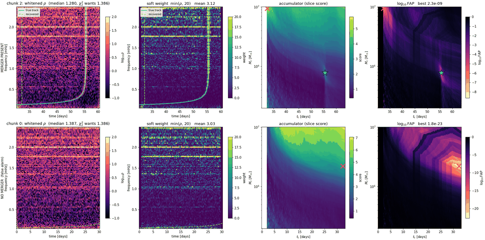
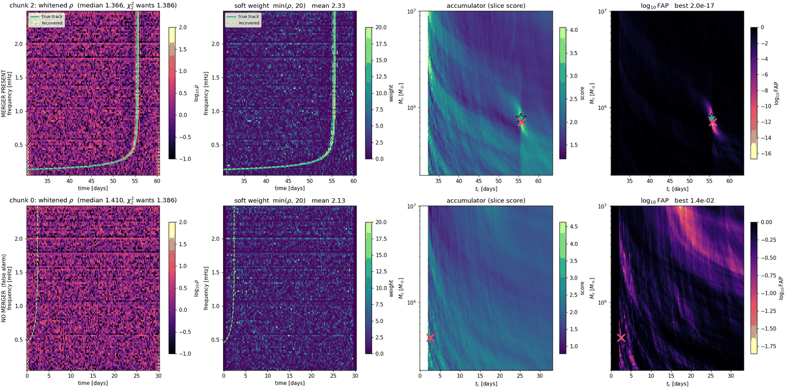
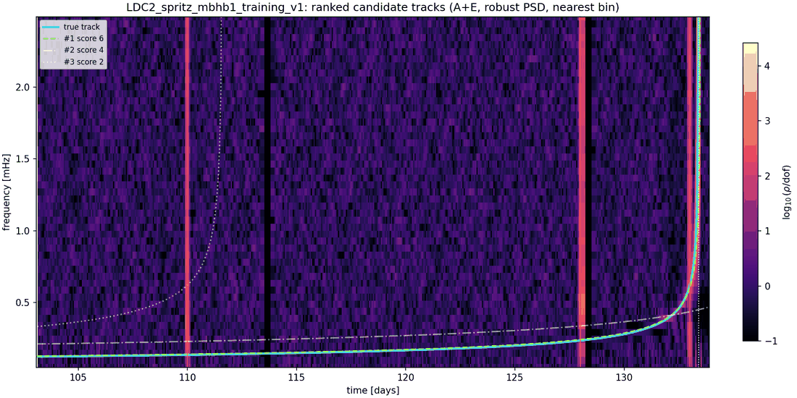
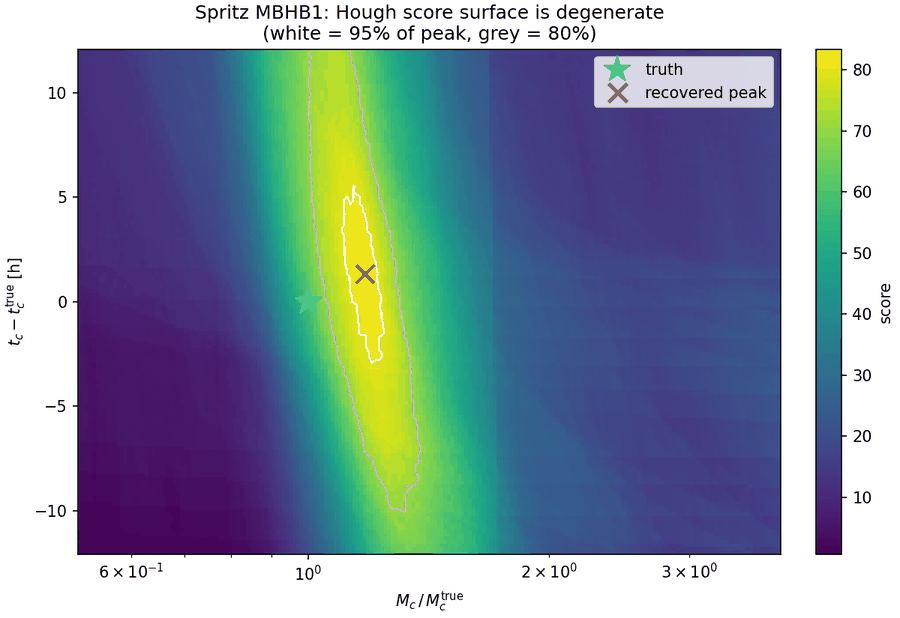

# Results

## Sangria training — MBHB, full year

23 chunks of 30.3 d, half-chunk step, FAP < 1e-6.

* **9/15 catalogue sources, 0 false alarms**, ~4 s for the year.
* Mass ratios ×0.71 – ×1.12. Merger-free chunks: FAP 2.9e-2 … 2.0e-1.

| truth Mc | tc [d] | ratio | Δtc [h] | FAP |
|---:|---:|---:|---:|---:|
| 7.82e5 | 55.6 | 0.800 | +8.8 | 1e-28 |
| 7.73e5 | 133.4 | **1.005** | +1.3 | 7e-43 |
| 2.73e6 | 157.6 | 0.891 | +8.9 | 5e-09 |
| 2.50e6 | 215.3 | 0.934 | +4.6 | 3e-09 |
| 1.11e6 | 236.4 | 0.806 | +7.2 | 4e-25 |
| 8.57e5 | 257.3 | 0.924 | +5.7 | 1e-21 |
| 1.97e6 | 271.3 | 1.117 | +3.2 | 8e-07 |
| 1.03e6 | 282.5 | 0.990 | +3.2 | 4e-08 |
| 3.87e6 | 341.6 | 0.707 | +10.9 | 6e-09 |

Missed: 101.2, 129.3, 130.3, 138.6, 191.3, 199.6 d.

* ⚠️ **Δtc systematically positive** (+1.3 to +10.9 h). Probably Newtonian ≠ IMRPhenomD.
  Unexplained, and it biases every seed.
* Nobili: **15/15** on the same data (~10 FA/yr). We're at 9/15 with 0 FA. They're ahead.

## Whitening quality drives everything

Top row = chunk with a merger, bottom = merger-free. Columns: whitened ρ → soft weight →
`(Mc,tc)` accumulator → log FAP. **Only difference between figures: PSD frequency resolution.**

* Before: bright horizontal stripes = resolved GBs surviving whitening. High-Mc templates are
  nearly flat → they lie along the lines → accumulator peaks in the high-Mc corner → merger-free
  chunk returns FAP 1e-23.
* After: lines absorbed, chirp is the brightest thing in the weight map, accumulator peaks on
  truth, same empty chunk returns 1e-2.

## Spritz — MBHB through glitches + gaps

31 d, merger at 30.4 d, 14 h gaps, 3 glitches (one 0.4 d pre-merger).

| | mbhb1 | mbhb2 |
|---|---|---|
| Mc | **×1.005** | best FAP 4e-2 |
| Δtc | +0.43 h | — |
| FAP | 9e-19 | **correctly insignificant** |

mbhb2 is ~45× weaker; "nothing here" is the right answer.

## Mc–tc degeneracy

* Tilted ridge — Mc trades against tc. Within 80% of peak: Mc/Mc_true ∈ [1.00, 1.37],
  tc ∈ [−10, +12] h. Truth inside 80% contour, outside 95%.
* Free track exponent: score flat from p = 0.34 to 0.45, amplitude compensating. That flat
  direction **is** the degeneracy.
* ⇒ **report a region, never the arg-max.**
* ⇒ **separate candidates by track overlap, not parameter distance** — two distant `(Mc,tc)` can
  trace the same curve.
* GFH linearisation should straighten this ridge.

## PSD ablation

Everything fixed except `S(t,f)`. FAP is common-mode so mis-calibration cancels.

| arm | sources | median ρ | Mc ratio | **Mc scatter** |
|---|---:|---:|---:|---:|
| `median_block` (robust, in situ) | 9/15 | 1.362 | 0.882 | **0.104** |
| `offset_chunk` (Nobili) | 8/15 | 1.403 | 0.881 | 0.192 |
| `global_median` | 10/15 | 1.451 | 0.878 | 0.259 |
| `spline` | 10/15 | **0.976** | 0.959 | 0.136 |

χ²₂ median = 1.386; below = PSD absorbed signal.

* ⚠️ **Detection count doesn't discriminate here** — 18/23 chunks contain a merger, so
  trigger-happy arms score by chance. Per-source is 8–10/15 in *every* arm.
* **Parameter accuracy does**, and it's the seeding deliverable: robust in-situ is tightest by
  1.3× (vs spline) to 2.5× (vs global median).
* Spline = clean absorption demo on real data.
* ⚠️ **Sangria MBHBs are transient → offset_chunk is legitimate here.** This is the case *least*
  favourable to us and it still wins on parameter accuracy. The always-on test is not run.

## GBs — diagnosis only

* Year-long coherent periodogram: **0/36** verification binaries. Not a search failure — annual
  Doppler spreads each source over tens of `1/T` bins (HMCnc 48 p-p, predicted 39). In-segment
  ridge SNR ~2600.
* `pm.remove_doppler` = `f/(1 + n·v/c)` transfers directly. `get_detector_velocities` does **not**
  — ground-IFO ephemeris = Earth orbit + sidereal rotation. LISA: heliocentric only,
  v/c = 9.94e-5.
* Barycentric resample + coherent year FFT:

| source | raw | demod | gain |
|---|---:|---:|---:|
| HMCnc | 9 bins | 2 | ×5.7 |
| ZTFJ1539 | 4 | 2 | ×2.5 |
| ZTFJ2243 | 6 | 2 | ×4.5 |

* Fitted orbital phase agrees across 4 sources (2.76–3.27) → ephemeris confirmed, not a fudge.
